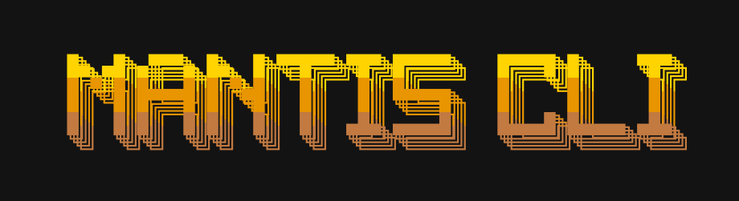

<p align="center">
  
</p>

<p align="center">
  <b>Spaces, maps, and MCP tools for AI coding agents, straight from your terminal.</b>
</p>

<p align="center">
  <a href="https://mantis.csail.mit.edu/docs/mantis-cli/">Docs</a> ·
  <a href="https://www.npmjs.com/package/mantisai-cli">npm</a> ·
  <a href="https://mantis.csail.mit.edu/developer/#keys">Get an API key</a> ·
  <a href="https://github.com/KellisLab/mantis-cli/issues">Issues</a>
</p>

<p align="center">
  <a href="https://www.npmjs.com/package/mantisai-cli"></a>
  <a href="https://www.npmjs.com/package/mantisai-cli"></a>
  <a href="https://nodejs.org"></a>
  <a href="https://modelcontextprotocol.io"></a>
  <a href="https://github.com/KellisLab/mantis-cli/blob/main/LICENSE"></a>
  <a href="https://mantis.csail.mit.edu"></a>
</p>

<p align="center">
  
</p>

---

**Mantis is a spatial data workspace.** It embeds records (dataset rows, documents, code files, anything with text) into a 2D semantic map where **proximity means similarity**, then auto-groups them into labelled clusters so the shape of a dataset is visible at a glance.

This CLI puts the whole workspace in your terminal. Every Mantis MCP tool is reachable through `mantis use <tool>` (**no editor plugin required**), so AI coding agents (Claude Code, OpenCode, Codex, Cursor, and more) can inspect, search, and reshape spatial data directly.

<table>
<tr><td><b>🧰 Full MCP surface</b></td><td>Every Mantis tool via <code>mantis use &lt;tool&gt;</code>: inspect, search, compare, set algebra, bags, pages, export. JSON in, JSON out. No MCP plugin needed.</td></tr>
<tr><td><b>🤖 Agent skill sync</b></td><td>One command installs editor skills for <a href="https://github.com/anthropics/claude-code">Claude Code</a>, <a href="https://github.com/sst/opencode">OpenCode</a>, <a href="https://github.com/openai/codex">Codex</a>, <a href="https://cursor.com">Cursor</a>, <a href="https://windsurf.com">Windsurf</a>, <a href="https://github.com/features/copilot">Copilot</a>, and <a href="https://antigravity.google">Antigravity</a>.</td></tr>
<tr><td><b>🔗 URI substrate</b></td><td>Every entity has a stable <code>mantis://</code> URI you pipe from one tool into the next: spaces, maps, clusters, bags, points, dimensions.</td></tr>
<tr><td><b>📦 Build maps locally</b></td><td>Turn a CSV/XLSX into a Mantis map, or index an entire codebase into a searchable semantic map in one call.</td></tr>
<tr><td><b>⚡ Fast cold start</b></td><td>Ships as a single bundled artifact, ~2.5× faster startup than an unbundled install. Bundled with Bun, runs on plain Node.</td></tr>
<tr><td><b>🔍 Scriptable</b></td><td>Spaces, threads, and tools all emit JSON. Drop it straight into <code>jq</code>, pipelines, or agent loops.</td></tr>
</table>

---

## Quick Start

```bash
npm install -g mantisai-cli      # Node ≥18, no Bun needed
mantis setup                     # API key + space + thread
mantis setup claude              # optional: install Claude Code skills
mantis use get_space_context     # confirm you're connected
```

Config lives at `~/.mantis/config.json`. Grab a developer key at **[mantis.csail.mit.edu/developer](https://mantis.csail.mit.edu/developer/#keys)**.

> **Naming:** repo [`KellisLab/mantis-cli`](https://github.com/KellisLab/mantis-cli) · npm package **`mantisai-cli`** · binary **`mantis`**.

## Using with [Claude Code](https://github.com/anthropics/claude-code)

Run `mantis setup claude` once to install the Mantis skills, then drive your spaces and maps straight from a Claude Code session, no MCP plugin required.

<p align="center">
  
</p>

See the [Claude Code guide](https://mantis.csail.mit.edu/docs/mantis-cli/claude-code.html) for the full workflow.

## Commands

| Command | Description |
| --- | --- |
| `mantis setup [editor]` | API + space/thread, or sync skills for `claude`/`opencode`/`codex`/`cursor`/`windsurf`/`copilot`/`antigravity` |
| `mantis status` | Show current space, thread, and config |
| `mantis select [space\|thread\|both]` | Switch the active space and/or thread |
| `mantis spaces list\|resolve\|set` | Scriptable space ops (JSON) |
| `mantis threads list\|new\|set` | Scriptable thread ops (JSON) |
| `mantis tools` | List every MCP tool and its arguments |
| `mantis use <tool>` | Call any MCP tool (JSON output) |
| `mantis create map <file>` | Build a map from a local CSV/XLSX |
| `mantis create codebase [root]` | Index a repo into CSV; add `--create-map` to embed it |

## The `mantis use` toolbox

Reach for these through `mantis use <tool>` (run `mantis tools` for full argument schemas):

| Tier | Tools |
| --- | --- |
| **Orient** | `get_space_context`, `inspect` |
| **Reason** | `search`, `compare`, `intersect`, `diff`, `union`, `export` |
| **Act** | `create_bag`, `add_to_bag`, `remove_from_bag`, `rename_bag`, `delete_bag`, `filter_to_bag`, `set_plot_variables`, `legend_command`, `create_page`, `project`, `install_extension` |

```bash
# Orient: what's in this space?
mantis use get_space_context

# Reason: semantically search a map
mantis use search --args '{"query":"memory systems","kind":"point","scope":["mantis://map/<id>"]}'

# Act: save a cluster as a reusable bag
mantis use create_bag --from-uri "mantis://map/<id>/cluster/<cid>" --name "My Bag"

# Act: project text (or a file's contents) onto a map as a new point, get its URI back
mantis use project --text "attention is all you need" --map-id <id>
mantis use project --file notes.md --map-id <id>
```

## Documentation

- [Overview](https://mantis.csail.mit.edu/docs/mantis-cli/)
- [Install](https://mantis.csail.mit.edu/docs/mantis-cli/install.html)
- [Claude Code](https://mantis.csail.mit.edu/docs/mantis-cli/claude-code.html) · [OpenCode](https://mantis.csail.mit.edu/docs/mantis-cli/opencode.html) · [Codex](https://mantis.csail.mit.edu/docs/mantis-cli/codex.html)

## Requirements

- **Node.js 18+** (the only runtime dependency; Bun is used to build, never to run)
- A Mantis **API + Developer key** → [mantis.csail.mit.edu/developer](https://mantis.csail.mit.edu/developer/#keys)

## Contributing

```bash
git clone https://github.com/KellisLab/mantis-cli.git
cd mantis-cli
bun install          # or: npm install
bun run build        # bundles bin/mantis.js -> dist/mantis.js
node dist/mantis.js --version
```

Publishing is automated: push a `v*` tag and the [GitHub Actions workflow](.github/workflows/publish-npm.yml) builds the bundle and publishes to npm.

---

<p align="center">
  <sub>Built at <a href="https://mantis.csail.mit.edu">MIT CSAIL</a> · <a href="https://github.com/KellisLab/mantis-cli/blob/main/LICENSE">MIT License</a></sub>
</p>


## Composer runs (account-restricted pilot)

`mantis composer` uses supported, authenticated HTTP run APIs. Your configured API key must belong to the server-enabled pilot account and have explicit `composer:access`, `composer:read`, `composer:execute`, or `composer:cancel` scopes for the commands you use. The server checks current permissions and revocation; a local username setting cannot grant pilot access.

```bash
mantis composer access
mantis composer capabilities
mantis composer run --chat-id CHAT_UUID --snapshot-id SNAPSHOT_UUID \
  --message-id analysis-attempt-1 --model-id MODEL_ID --effort high --file request.txt
mantis composer status RUN_UUID
mantis composer events RUN_UUID --after 0 --limit 100
mantis composer resume RUN_UUID --after LAST_SEQUENCE --pages 10
mantis composer cancel RUN_UUID --request-token CANCEL_UUID
```

Obtain the exact model ID and supported reasoning options from `composer capabilities`. A saved chat and prepared context snapshot must already exist in a supported Mantis client; this command group does not silently choose live Space data or create context. Pass their UUIDs explicitly. Creating a chat and freezing context entirely from the CLI requires additional authenticated server API support.

Use exactly one of `--message` or `--file`. Choose a stable `--message-id` before submitting and reuse the same request after a timeout or lost response. An accepted receipt can contain a `dispatch_error`: the run still exists, so inspect its state or retry with that same identity. To continue an existing native conversation, send a new request with the same saved chat, a newly prepared snapshot, and a new message identity; the server verifies whether its retained native history can be resumed.

`events` prints one actual ordered journal page. `resume` prints up to `--pages` pages as JSON lines and **only resumes reading**, without submitting an analysis. Save the returned `next_after_sequence` for the next read. Explicit `history_incomplete` and `retention_gaps` fields report missing retained observations; the CLI does not manufacture replacements. Reading events does not take over a browser connection's cursor.

Use one stable UUID cancellation token per Stop request. Keep the canonical token returned by the server for retries. A pending cancellation receipt means Stop is still being resolved; only the server's actual terminal state confirms the process ended. Disabling new native execution still permits authorized retained status, replay, and Stop according to server policy.
